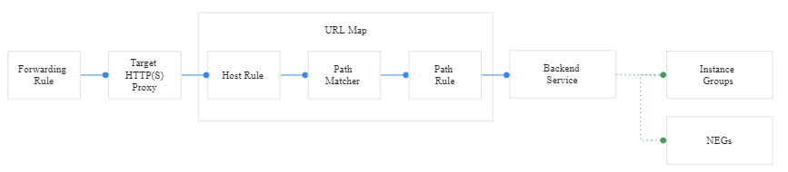
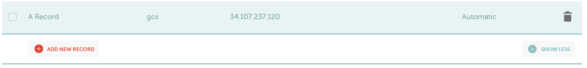
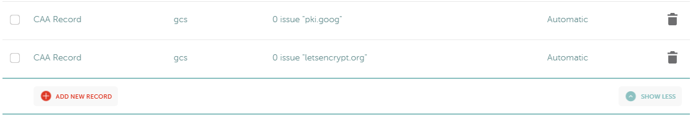
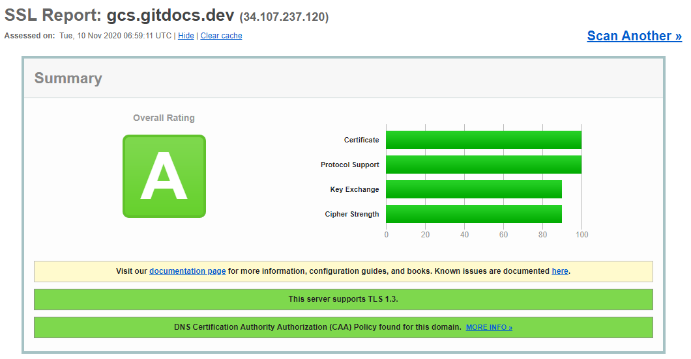
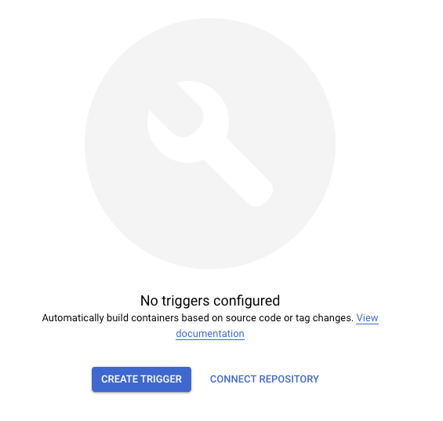
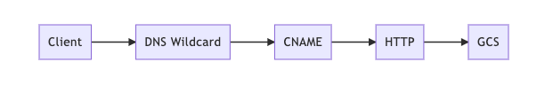
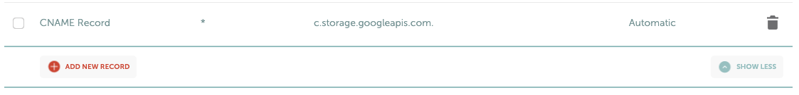
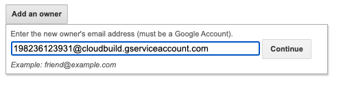
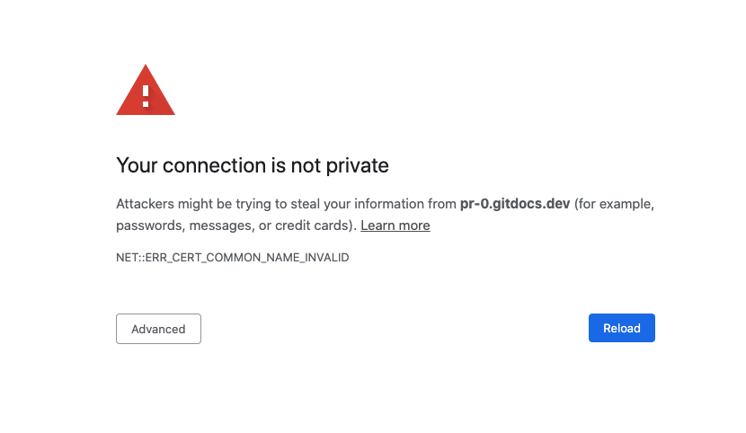
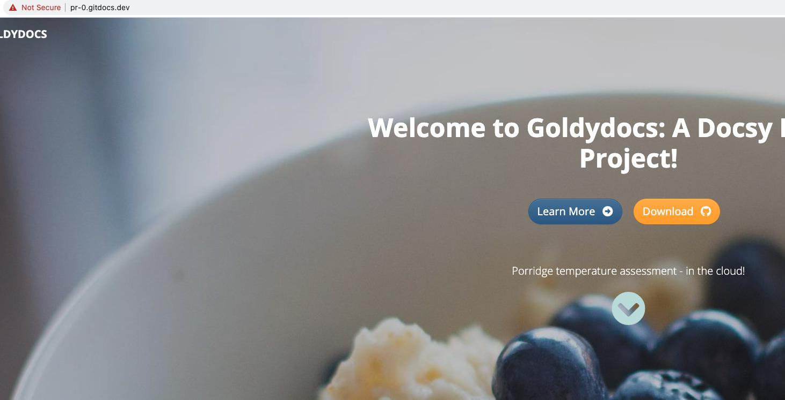

# Google Docs as Code (Google Cloud Storage)

This guide covers:

- Setting up a docs repo
- Manually configure CI/CD using Cloud Build
    - Including auto-deploy to Google Cloud Storage
- Adding a custom domain URL 
- Automating future builds

This example repo is hosted it: http://gcs.gitdocs.dev

## Before Starting

Have a high level understanding of static sites, Cloud Build, and Google Cloud Storage (GCS). Cloud Build is a YAML based CI/CD system that instructs how we deploy to GCS.

Cloud Build [pricing](https://cloud.google.com/cloud-build/pricing) is $0.003 a build-minute. The first 120 builds-minutes per day are free.


## Fork this repo

This demo is based of the [docsy example site](https://github.com/google/docsy-example). Create a fork of this repository to be deployed in your own Google project. By creating a fork you can customize as needed.

```
git clone path-to-your-fork:username/<repo>
cd <repo> 
```

For information on customizing and maintaining a docsy site please see the [official docs](https://www.docsy.dev/docs/adding-content/).

## GCP Setup

Create and `set` project. Setup billing if not completed already.

```
GC_PROJECT=docs-gcs-test
gcloud projects create $GC_PROJECT
gcloud config set project $GC_PROJECT
```

Enable APIs.

```
gcloud services enable \
cloudbuild.googleapis.com \
compute.googleapis.com
```

Set permissions on the Cloud Build service account.

```
GC_PROJECT=docs-gcs-test

GC_PROJECT_NUMBER=$(gcloud projects list \
--filter="$GC_PROJECT" --format="value(PROJECT_NUMBER)")

# Grant the roles/storage.admin to the Cloud Build service account
gcloud projects add-iam-policy-binding $GC_PROJECT \
  --member "serviceAccount:$GC_PROJECT_NUMBER@cloudbuild.gserviceaccount.com" \
  --role roles/storage.admin
```

## Create website bucket

```
BUCKET_NAME=gcs.docsy.dev

gsutil mb -b on gs://$BUCKET_NAME
```


## Manually trigger Cloud Build

Running the following creates the container and deploys it under a random domain URL on Cloud Run. In subsequent steps we give it a custom domain and automate the build trigger.

> There's an [issue with .git directories](https://github.com/GoogleCloudPlatform/cloud-builders/issues/236) with Cloud Build that excludes `.git` folders which we avoid by disabling `gcloudignore`.

```
gcloud config set gcloudignore/enabled false
gcloud builds submit --substitutions _ENVIRONMENT="production"
```

## Create a external HTTP(S) load balancer with Cloud CDN enabled.

To help with the terminology see this pic:



We've already created the backend, let's work our way from right to left.

Configure the backend

```
gcloud compute backend-buckets create gcs-gitdocs-bucket \
    --gcs-bucket-name=$BUCKET_NAME \
    --enable-cdn
```

Configure the URL map

```
gcloud compute url-maps create https-lb \
    --default-backend-bucket=gcs-gitdocs-bucket
```

Create a Google-managed SSL certificate for the target proxy

```
# wildcards are not supported at this time.
# domains can be listed as comma separated but each domain MUST point to the lb IP
DOMAINS="gcs.gitdocs.dev"

gcloud compute ssl-certificates create gcs-gitdocs-cert \
    --description="ssl lb cert for prod gcs site" \
    --domains=$DOMAINS \
    --global
```

Configure the target proxy

```
gcloud compute target-https-proxies create https-lb-proxy \
    --url-map=https-lb --ssl-certificates=gcs-gitdocs-cert \
    --global-ssl-certificates \
    --global
    
    
--ssl-policy SSL_POLICY_NAME
```

Reserve a static IP for the forwarding rule

```
gcloud compute addresses create gcs-gitdocs-dev-ip \
    --network-tier=PREMIUM \
    --ip-version=IPV4 \
    --global
```

Configure the forwarding rule
```
gcloud compute forwarding-rules create https-lb-forwarding-rule \
    --address=gcs-gitdocs-dev-ip \
    --global \
    --target-https-proxy=https-lb-proxy \
    --ports=443
```

### Setup DNS / test

Update the DNS A records to point to the load balancer's IP address

```
gcloud compute addresses describe gcs-gitdocs-dev-ip \
    --format="get(address)" \
    --global
```



### Add CAA records (optional)

Specifying the CAs that are allowed to issue your Google-managed certificate ([example](https://cloud.google.com/load-balancing/docs/ssl-certificates/google-managed-certs#caa)):




Check dig (DNS look up test)

```
dig gcs.gitdocs.dev
```

Output:

```
; <<>> DiG 9.16.1-Ubuntu <<>> gcs.gitdocs.dev
;; global options: +cmd
;; Got answer:
;; ->>HEADER<<- opcode: QUERY, status: NOERROR, id: 22039
;; flags: qr rd ra; QUERY: 1, ANSWER: 1, AUTHORITY: 0, ADDITIONAL: 1

;; OPT PSEUDOSECTION:
; EDNS: version: 0, flags:; udp: 65494
;; QUESTION SECTION:
;gcs.gitdocs.dev.               IN      A

;; ANSWER SECTION:
gcs.gitdocs.dev.        1799    IN      A       34.107.237.120

;; Query time: 151 msec
;; SERVER: 127.0.0.53#53(127.0.0.53)
;; WHEN: Tue Nov 10 06:04:02 UTC 2020
;; MSG SIZE  rcvd: 60

```

If interested in checking CAA:

```
dig caa gcs.gitdocs.dev
```

\>\>\> **Provisioning a Google-managed certificate might take up to 60 minutes.** <<<

Validate provisioning status of SSL cert on GCP

```
# Wait for status to no longer be "PROVISIONING"

gcloud compute ssl-certificates describe gcs-gitdocs-cert \
    --format="get(managed.domainStatus)"
```

\>\>\> **Provisioning a Google-managed certificate might take up to 60 minutes.** <<<

## (optional) Set stricter SSL policies on the proxy

If you have a need for stricter SSL settings on your site, you can create a policy and add it to your https proxy.

```
# create the new policy
gcloud compute ssl-policies create min-tls-modern \
  --profile MODERN --min-tls-version 1.2

# update the proxy to use the policy
gcloud compute target-https-proxies update https-lb-proxy \
    --ssl-policy min-tls-modern
```

More info on [SSL policies](https://cloud.google.com/load-balancing/docs/ssl-policies-concepts).



## Automating build trigger

Since I already installed the Cloud Build app for another repo, I was able to enable the app for this repo, making adding the trigger a lot easier. To see the instructions on installing the Cloud Build app [click here](https://github.com/jimangel/docsy-cloud-run#install-cloud-build-github-app). Before you can add the trigger, you must connect the repo.

Skip the creating the trigger, as we'll do that through `gloud` next.



See instructions to **Connect Repository** [here](https://cloud.google.com/cloud-build/docs/automating-builds/create-manage-triggers#connect_repo).

```
REPO_NAME=docsy-gcs-buckets
REPO_OWNER=jimangel

gcloud beta builds triggers create github \
    --name="prod-github" \
    --repo-name=$REPO_NAME \
    --repo-owner=$REPO_OWNER \
    --branch-pattern="main" \
    --substitutions _ENVIRONMENT="production" \
    --build-config=cloudbuild.yaml
```

## Automating PR previews

Given the complexities of setting up a HTTPS load balancer on GCP, the dynamic cert creation would take very long for PRs. A few alternate solutions exist:

* Use a self-managed wildcard certificate
    * LB provisioning would still take some time
    * Clean up is difficult
* Automate sub-path previews using url maps
    * Uses production URL
    * Potentially impacts production site routing
* Use a different CDN like Cloud Flare for auto-HTTPS
    * Clean up is difficult

For simplicity sake, we'll deploy via wildcard CNAME and HTTP to a bucket that has a short retention period.




### Setup DNS

Point a wildcard to the GCS CNAME. An exact DNS match (subdomain) will take precedence over a wildcard.

> \*.gitdocs.dev CNAME c.storage.googleapis.com.



This might not happen for everyone, but I had to add the Cloud Build service account (`$GC_PROJECT_NUMBER@cloudbuild.gserviceaccount.com`) as the domain owner at https://www.google.com/webmasters/verification/home



> Do **NOT** use https://search.google.com/


### Setup build manually

```
gcloud builds submit \
--substitutions _ENVIRONMENT="staging",_STAGE_BUCKET_URL="pr-0.gitdocs.dev"
```

You should now be able to vist http://pr-0.gitdocs.dev. Since the site is HTTP you will probably get the following warning:



If using chrome, type in `thisisunsafe` and the page should load:



### Create PR trigger

One of the most important parts of CI/CD is automating previews when a PR is opened. To do this, add anotehr trigger named `pr-trigger`.

```
REPO_NAME=docsy-gcs-buckets
REPO_OWNER=jimangel

gcloud beta builds triggers create github \
    --name="pr-trigger" \
    --repo-name=$REPO_NAME \
    --repo-owner=$REPO_OWNER \
    --pull-request-pattern="^main$" \
    --build-config=cloudbuild.yaml \
    --substitutions _ENVIRONMENT="staging" \
    --comment-control=COMMENTS_DISABLED
```

### Create GitHub Preview Comment (optional)

If you'd like Cloud Build to respond with a URL and instructions about previewing the URL, see instructions [here](https://github.com/jimangel/docsy-cloud-run#create-github-api-secret-optional).

It would consist of creating the KMS in GCP and updating `cloudbuild.yaml`

## Testing and debugging

While CDN is enabled, it's possible that it's not configured. You want to [validate cache is working](https://cloud.google.com/cdn/docs/logging) and review TTL [cache methods](https://cloud.google.com/cdn/docs/using-ttl-overrides#default-ttl).

You set [cache-control headers](https://cloud.google.com/storage/docs/metadata#cache-control) via `gsutil` on the bucket to allow [cacheability](https://cloud.google.com/cdn/docs/caching#cacheability). Like:

```
# Enable cache control for 1 hour
gsutil setmeta -r -h "Cache-control:public, max-age=3600" gs://bucket_name
```

To invalidate all [cache](https://cloud.google.com/cdn/docs/invalidating-cached-content):

```
gcloud compute url-maps invalidate-cdn-cache https-lb --path "/*"
```

## Considerations

- Move previews to an HTTPS solution
- Improve caching performance

## Helpful resources

- [Setting up Cloud CDN with a backend bucket](https://cloud.google.com/cdn/docs/setting-up-cdn-with-bucket#gcloud)
- [Trivial Static Site Hosting with Hugo and GCS](https://www.realjenius.com/2019/11/25/cloudbuild-hugo-gcs/)
- [Hosting a static website](https://cloud.google.com/storage/docs/hosting-static-website)
- [Serving websites](https://cloud.google.com/solutions/web-serving-overview)
- [Static website examples and tips](https://cloud.google.com/storage/docs/static-website)
- [Domain-named bucket verification](https://cloud.google.com/storage/docs/domain-name-verification)
- [Using Google-managed SSL certificates](https://cloud.google.com/load-balancing/docs/ssl-certificates/google-managed-certs)
